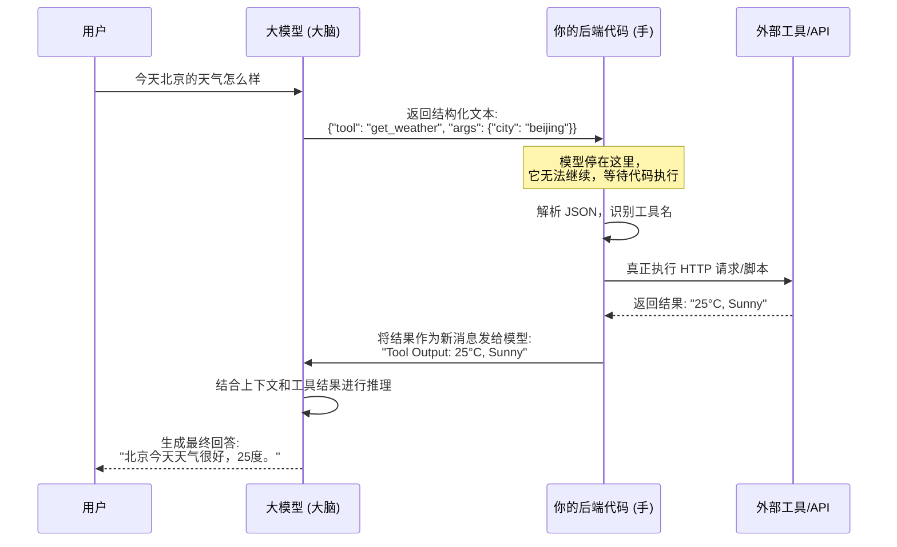
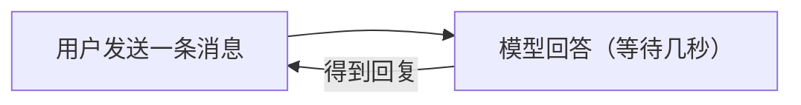
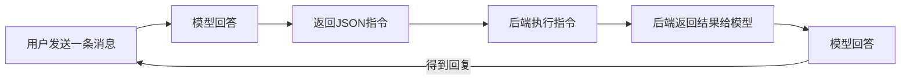

## 定义：

让模型不止能够聊天，还拥有调用系统工具的能力（查数据库/API/代码等）
## 原理：

模型输出一段JSON指令，往往包含：需要执行的指令/工具、参数等，例如模型想要查询北京的天气：
```json
{
	"tool": "get_weather",
	"args": {
		"city": "beijing",
		"date": "2026-03-11"
	}
}
```

后端接收到这个JSON指令后执行对应的代码得到结果后输入给模型，模型根据数据给出回答
## 澄清：

**模型并不会真的调用函数**，模型本质上只是一个“文本预测模型”，没有网络权限、无法执行代码。它能做的只是，输出一段“需要调用xx工具获取xx信息”的指令，然后由后端来执行这个命令，得到结果后输入给模型，模型再根据这个“文本信息”，给出回答。
## 流程：
1. 用户提问：“今天北京的天气怎么样”
2. 模型思考：
	1. 用户需要查询今天北京的天气
	2. 输出JSON格式的指令，例如`{"tool":"get_weather","args":{"city":"beijing"}}`
3. 后端接收到模型给出的输出：
	1. 解析JSON
	2. 发现tool是get_weather，调用函数，传入参数
	3. 得到结果
4. 后端拿到数据后将结果作为新的消息返回给模型
5. 模型得到数据后进行回答


## 注意点

### 工具调用会显著增加Token的消耗和API请求次数

由于工具调用并不是模型本身来操作，而是返回JSON指令，由后端执行，得到结果后再返回给模型，所以这里实际上是两次对话。

- 在用户层面来看：

- 在代码层面来看：

并且对于早期或缺少优化的模型来说，工具调用可能会引发多次API请求，例如“查询一下现在北京、上海和天津的天气”，模型可能会发出多次指令，分别查询北京、上海、天津的天气，并分别返回数据，现代模型优化后则可以一次性返回所有数据，整合为一次API请求。

|维度|普通对话 (无工具)|工具调用对话 (有工具)|
|:--|:--|:--|
|API 请求次数|1 次|N + 1 次 (N=调用的工具数量，通常至少 2 次)|
|Token 消耗|较少 (输入+输出)|显著增加  <br>1. 第一次输出的 Token (工具指令)  <br>2. 第二次输入的 Token (把工具结果塞回上下文)  <br>3. 第二次输出的 Token (最终回答)|
|延迟 (Latency)|低 (只等一次生成)|较高  <br>总耗时 = (模型思考时间 1) + (工具执行时间) + (模型思考时间 2)|
|上下文长度|线性增长|跳跃式增长  <br>因为要把工具的执行结果（有时数据量很大）重新塞回对话历史中。|
### 应对方式：
 **A. 调整限流策略 (Rate Limiting)**

不要按照“用户数”来设定限流，要按照**“预期最大 API 调用次数”**来设定。

- 如果你的业务重度依赖工具（如数据分析助手），建议将内部限流阈值设为理论值的 **1/3 或 1/4**，预留缓冲空间。

**B. 实现“并行工具调用” (Parallel Tool Calling)**

现代模型（如 GPT-4o, Qwen-Max）支持**一次性返回多个工具调用指令**。

- **低效做法**：模型说“查北京”，代码查完发回去；模型再说“查上海”，代码查完再发回去。（耗时：3 轮 API）
- **高效做法**：模型一次性说“查北京、上海、广州”。你的代码**并发执行**这三个查询，然后一次性把三个结果打包发回给模型。（耗时：2 轮 API）
- **收益**：将 N+1 轮请求压缩为 **2 轮**，极大节省 RPM。

**C. 优化上下文 (Context Optimization)**

在把工具结果发回给模型前，**清洗数据**。

- 如果天气 API 返回了 5KB 的 JSON（包含湿度、风向、紫外线、空气质量等所有字段），但用户只问“多少度”，请在代码层提取出 `{"temp": 25}` 再发给模型。
- 这能大幅减少 **TPM** 消耗，间接缓解因 Token 过长导致的请求排队或拒绝。

**D. 降级策略 (Fallback)**

当检测到 RPM 接近上限时：

- 暂时禁用非核心工具。
- 让模型直接回答：“目前查询服务繁忙，我无法获取实时数据，但根据常识...”
- 或者排队处理，让用户稍等。

## 通信

怎么设置模型调用脚本的方法，让模型知道需要哪些参数？--> [[MCP]]