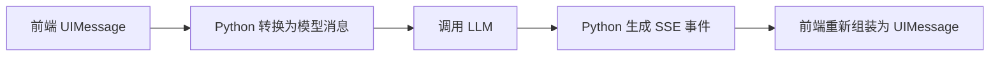

## 目的

这篇文档记录当前聊天链路里最常见的三种消息格式：

- 前端 `UIMessage` 格式
- Python 后端返回给前端的 SSE 事件格式
- Python 发给模型的消息格式

它们分别服务于三个不同层面：

- `UIMessage`：前端界面状态
- `SSE`：前后端流式通信
- 模型消息：后端与 LLM 的对话上下文

## 1. 前端 UIMessage 格式

前端使用的是Velcel AI SDK 的 `UIMessage` 结构。它不是直接发给模型的原始格式，而是更适合界面渲染和流式增量更新的格式。

一个简化后的例子：

```json
{
  "id": "msg_123",
  "role": "assistant",
  "parts": [
    {
      "type": "step-start"
    },
    {
      "type": "text",
      "text": "我先帮你读取技能文件。"
    },
    {
      "type": "tool-read_file",
      "toolCallId": "call_1",
      "state": "output-available",
      "input": {
        "file_path": "skills/weather/SKILL.md"
      },
      "output": {
        "success": true,
        "file_path": "skills/weather/SKILL.md",
        "content": "..."
      }
    },
    {
      "type": "step-start"
    },
    {
      "type": "text",
      "text": "我已经读完这个技能文件了。"
    }
  ]
}
```

### 常见字段

- `id`
  当前消息的唯一标识。
- `role`
  消息角色，常见值有 `user`、`assistant`、`system`。
- `parts`
  一条消息会被拆成多个 part。

### 常见 part 类型

- `text`
  纯文本内容。
- `step-start`
  一轮推理或工具调用的边界标记。
- `tool-xxx`
  工具调用相关片段，例如 `tool-read_file`、`tool-exec_command`。

### tool part 的常见字段

- `toolCallId`
  这次工具调用的唯一 id。
- `state`
  当前工具调用状态。
- `input`
  模型传给工具的参数。
- `output`
  工具执行后的结果。

### 常见 state

- `input-streaming`
  工具参数还在流式生成中。
- `input-available`
  工具参数已经完整可用。
- `output-available`
  工具执行成功并有结果。
- `output-error`
  工具执行失败。

### 为什么要有 step-start

`step-start` 的作用是把 assistant 的多轮行为拆开。例如：

- 第一步：模型先输出一句话，然后调用工具
- 第二步：工具返回后，模型再继续回答

在 UIMessage 中，这两步虽然可能都属于同一条 assistant 消息，但会通过多个 `step-start` 分段，前端就能据此渲染成多个气泡或多个阶段。

### 格式定义规则
这里的格式不唯一，这只是Vercel AI SDK定义的格式而已，在自行开发中只要前后端定义的数据格式一致就可以，没有固定的格式要求。

#### 典型AI事件协议设计
一个完整的协议设计一般会包括：

**Session**
```text
session_start
session_end
```

**推理**
```text

```

## 2. SSE 事件格式

前后端之间的流式传输使用的是 SSE，也就是 `Server-Sent Events`。

Python 后端并不是一次性返回整段 JSON，而是持续返回多条事件。每条事件长这样：

```text
data: {"type":"start","messageId":"msg_xxx"}

data: {"type":"start-step"}

data: {"type":"text-start","id":"text_xxx"}

data: {"type":"text-delta","id":"text_xxx","delta":"你好"}

data: {"type":"text-end","id":"text_xxx"}

data: {"type":"finish-step"}

data: {"type":"finish","finishReason":"stop"}
```

### SSE 的基本规则

- 每条事件以 `data: ` 开头
- 后面跟一段 JSON
- 事件之间用空行分隔，也就是两个换行 `\n\n`

Python 后端里对应的封装逻辑是：

```python
def _sse_line(chunk):
    return f"data: {json.dumps(chunk, ensure_ascii=False)}\n\n".encode("utf-8")
```

### 当前会用到的事件类型

#### 会话级事件

- `start`
  一条 assistant 消息开始。
- `finish`
  一条 assistant 消息结束。
- `error`
  本次流式处理出错。

#### step 级事件

- `start-step`
  一轮 step 开始。
- `finish-step`
  一轮 step 结束。

#### 文本事件

- `text-start`
  一段文本开始。
- `text-delta`
  文本增量。
- `text-end`
  一段文本结束。

#### 工具事件

- `tool-input-available`
  工具参数已经准备好。
- `tool-output-available`
  工具执行成功。
- `tool-output-error`
  工具执行失败。

### 文本事件示例

```json
{"type":"text-start","id":"text_1"}
{"type":"text-delta","id":"text_1","delta":"我来帮你读取文件。"}
{"type":"text-end","id":"text_1"}
```

### 工具事件示例

```json
{
  "type": "tool-input-available",
  "toolCallId": "call_1",
  "toolName": "read_file",
  "input": {
    "file_path": "skills/weather/SKILL.md"
  }
}
```

```json
{
  "type": "tool-output-available",
  "toolCallId": "call_1",
  "output": {
    "success": true,
    "file_path": "skills/weather/SKILL.md",
    "content": "..."
  }
}
```

### SSE 和 UIMessage 的关系

可以把 SSE 理解成“运输中的增量事件”，把 UIMessage 理解成“前端组装后的完整状态”。

也就是说：

- 后端发的是一条条 SSE 事件
- 前端收到后按协议拼装
- 最终在 React 组件里拿到的是 `UIMessage`

## 3. 模型消息格式

Python 调用模型时，使用的是 Chat Completions 风格的消息格式。

一个最简单的例子：

```json
[
  {
    "role": "system",
    "content": "你是一个全能的AI助手。"
  },
  {
    "role": "user",
    "content": "帮我读取天气技能文件"
  }
]
```

### 常见 role

- `system`
  系统提示词。
- `user`
  用户消息。
- `assistant`
  模型消息。
- `tool`
  工具执行结果。

## 4. 带工具调用的模型消息格式

当模型请求工具时，assistant 消息里会出现 `tool_calls`。

例如：

```json
{
  "role": "assistant",
  "content": "我先读取这个文件。",
  "tool_calls": [
    {
      "id": "call_1",
      "type": "function",
      "function": {
        "name": "read_file",
        "arguments": "{\"file_path\":\"skills/weather/SKILL.md\"}"
      }
    }
  ]
}
```

注意：

- `arguments` 是字符串，不是对象
- 它里面通常还是一段 JSON 文本

工具执行完以后，后端需要补一条 `tool` 消息回去，例如：

```json
{
  "role": "tool",
  "tool_call_id": "call_1",
  "content": "{\"success\":true,\"file_path\":\"skills/weather/SKILL.md\",\"content\":\"...\"}"
}
```

这样下一轮模型才能知道：

- 自己刚刚调用了哪个工具
- 该工具返回了什么结果

## 5. 三种格式之间的转换关系

当前链路里的转换关系是：



也可以展开理解为：

1. 前端把消息历史按 `UIMessage` 发给后端
2. 后端把 `UIMessage` 转成模型能理解的 `messages`
3. 模型返回普通文本或 `tool_calls`
4. 后端执行工具，并把过程编码成 SSE
5. 前端消费 SSE，再恢复成 `UIMessage`

## 6. 为什么不能只保留一种格式

因为这三种格式面向的对象不同：

- `UIMessage` 面向前端 UI
- `SSE` 面向流式传输协议
- 模型消息面向大模型接口

如果强行只用一种格式，会出现问题：

- 直接拿模型消息渲染前端，缺少 step 和流式状态信息
- 直接把 UIMessage 发给模型，模型接口无法识别
- 直接把 UIMessage 作为网络流格式，传输层会过重且不利于增量消费

所以当前设计的核心思想是：

- 前端展示用 `UIMessage`
- 传输过程用 `SSE`
- 模型调用用 `chat completions messages`

## 7. 当前项目中的关键对应关系

### 前端消息入口

- `packages/web/app/chat.tsx`

### Next 代理聊天接口

- `packages/web/app/api/chat/route.ts`

### Python SSE 输出与模型交互

- `packages/server/app/services/chat.py`

### Python 聊天路由入口

- `packages/server/app/main.py`

## 8. 小结

这三种格式可以简单记成：

- `UIMessage`：给前端看的
- `SSE`：给网络流传输用的
- 模型消息：给大模型接口用的

它们不是彼此重复，而是同一条聊天链路在不同阶段的不同表示方式。
